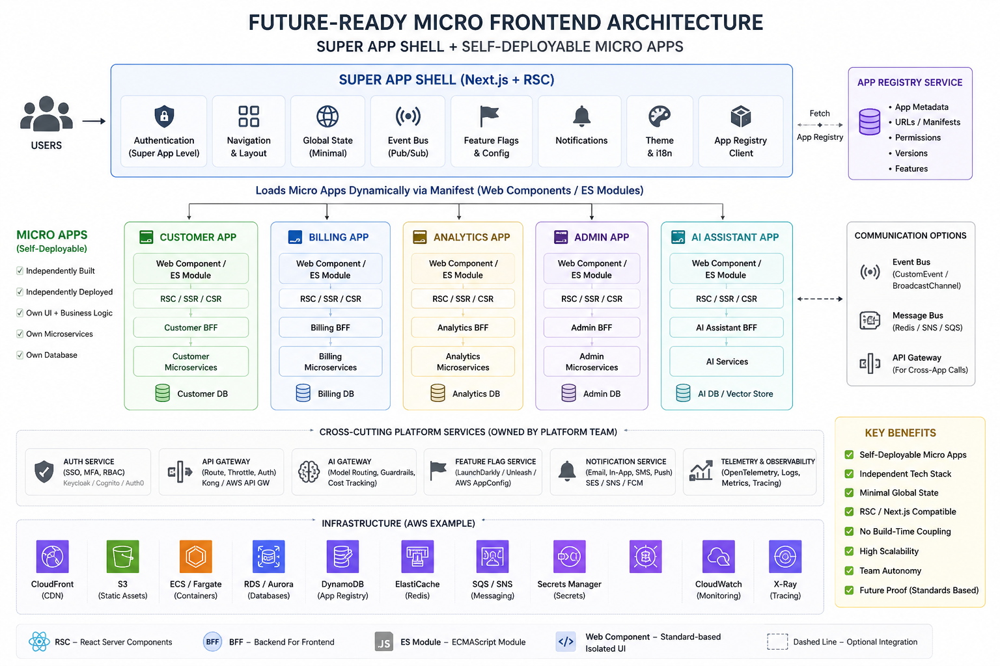

# Open Micro Platform

Future-ready micro frontend platform POC for self-deployable, AI-native apps.

This project is an experiment in where frontend architecture is going: apps that can run in a normal web shell, stream through React Server Components, ship as static/SSR/SSG/ISR fragments, or become capability surfaces inside AI hosts through MCPApps-style metadata.



## Why This Exists

We already have strong tools such as single-spa and webpack Module Federation. This project explores a different center of gravity:

- No required webpack Module Federation runtime.
- No shell build-time coupling to remote app source.
- Framework-neutral apps: React, Vue, Angular, Web Components, static HTML, SSR/SSG/ISR fragments, or iframes.
- Next.js shell with App Router, RSC routes, Suspense, and client runtime islands.
- Manifest-first registry that can become a real platform control plane.
- Async event-driven communication instead of direct imports and shared mutable business state.
- MCPApps-style tools, resources, prompts, permissions, and event namespaces for AI-native surfaces.
- Runtime error fallback and structured logging so one app cannot take down the shell.

The long-term vision is simple: a micro app should be a portable capability surface. It can launch inside a browser shell, an enterprise portal, ChatGPT, Claude, or any future host that understands the same manifest and event contracts.

## What Runs Today

The demo shell registry includes:

- Customer App, port `5173`
- Billing App, port `5174`
- Analytics App, port `5175`
- Admin App, port `5176`
- AI Assistant App, port `5177`
- Vue Commerce App, port `5178`
- Angular Operations App, port `5179`
- Design System Contract App, port `5180`
- Knowledge Center static HTML fragment, served by the shell

Each app owns its UI, manifest, runtime server, styles, and deployment lifecycle. The shell owns discovery, composition, navigation, platform context, error isolation, and the registry client.

## Current Stack

- Next.js `16.2.9` App Router shell
- React `19.2.7`
- Vite `8.0.16` micro app builds
- Tailwind CSS `4.2`
- pnpm workspaces
- Browser-native CustomEvent event bus
- Publishable TypeScript SDK package under `packages/platform-sdk`

## Architecture

The shell discovers apps through a registry, then chooses the right renderer by manifest metadata:

- `web-component`: best default for React, Vue, Angular Elements, Lit, Stencil, or plain Custom Elements.
- `module`: remote ESM bundle exports `mount(container, context)`.
- `html-fragment`: trusted static, SSR, SSG, or ISR HTML fetched from a Server Component path.
- `iframe`: isolated hosted experience.

Each renderer has explicit loading, ready, empty, and error states. Client islands use SDK runtime states and a first-render readiness check. Server-rendered HTML fragments are wrapped with Suspense and show empty/error fallbacks. Iframe and MCP Apps resources include their own loading and failure surfaces. The goal is simple: a remote can fail, but the shell should not go white.

The shell can pass stable platform context through mount props or attributes:

- auth/session
- tenant
- theme
- locale
- feature flags
- permissions
- shell origin

Ongoing communication should be async and event-driven:

- shell to app
- app to shell
- app to app
- app to AI host
- AI host to app

The current SDK uses browser `CustomEvent`. A production platform can bridge the same event contract to BroadcastChannel, WebSocket, Redis, SNS/SQS, Kafka, or an API gateway.

## Platform SDK

The reusable runtime lives in `packages/platform-sdk`.

SDK entrypoints:

- `@micro-frontend/platform-sdk/client`: micro app helpers such as `defineMicroAppElement`, app event emission, and MCPApps event emission.
- `@micro-frontend/platform-sdk/shell`: shell runtime helpers for registry resolution, HTML fragment fetches, observability, and client island mounting contracts.
- `@micro-frontend/platform-sdk/next`: server-safe helpers and types for a Next.js shell.
- `@micro-frontend/platform-sdk/registry`: injectable registry sources for inline, async, local, or remote JSON manifests.
- `@micro-frontend/platform-sdk/runtime-state`: shared loading, ready, empty, error, and readiness helpers for shell renderers.
- `@micro-frontend/platform-sdk/event-bus`: async browser event bus and MCP-oriented event names.
- `@micro-frontend/platform-sdk/mcp-app`: MCP Apps bridge helpers, resource descriptors, and standalone HTML resource generation.
- `@micro-frontend/platform-sdk/observability`: normalized error reporting and configurable loggers.
- `@micro-frontend/platform-sdk/web-mcp`: browser-agent WebMCP tool registration helpers.

## Shared Design System Without Module Federation

This POC uses a shell-owned singleton design contract instead of Webpack Module Federation singletons. The shell imports `@micro-frontend/design-system/tokens.css` once at the root, and every micro app consumes the same `--omf-*` CSS variables at runtime. Framework apps can still keep their own rendering stack, but design tokens, theme, density, and brand decisions come from the platform contract.

The design system package is importable:

```ts
import '@micro-frontend/design-system/tokens.css'
import { designSystemComponents, getDesignSystemComponentTag } from '@micro-frontend/design-system'
```

The runtime design-system remote also exposes shared Web Components such as `omf-platform-header` and `omf-platform-footer`, so shell teams can either import typed contracts or load shared UI at runtime.

For shared JavaScript packages, treat them as contracts:

- Small stable contracts such as tokens, event names, types, and SDK helpers should be peer/version governed by the registry and CI.
- Heavy framework runtimes should not be forced into a global singleton across React, Vue, and Angular. Independent apps can own those versions, and the platform should measure bundle budgets.
- Shared UI should prefer standards-first delivery: CSS variables, web components, generated CSS, assets, and typed contracts. This works across repos and across frameworks.
- If a package must be singleton, publish it as a platform package, enforce compatible semver in manifests, and let the shell provide it once.

The `Design System Contract` micro app demonstrates this model in the dashboard.

Micro app wrapper example:

```ts
import { defineMicroAppElement, emitMcpAppEvent } from '@micro-frontend/platform-sdk/client'

defineMicroAppElement('micro-orders-app', {
  mount(host, context) {
    host.innerHTML = `<strong>${context.app.name}</strong>`

    emitMcpAppEvent('MCP_TOOL_CALL_REQUESTED', context.app.id, {
      tool: 'orders.search',
    })

    return () => host.replaceChildren()
  },
})
```

## MCPApps Direction

Each app can declare MCPApps-style capabilities:

- tools
- resources
- prompts
- event namespaces
- permissions
- manifest URL
- owner and version

When launched in a normal shell, an app can use its own BFF and render its own content. When launched in an AI host, the host can provide context, data, tool results, or prompt input through the same event/manifest contract.

The AI Assistant demo emits:

- `mcp:tool-call-requested`
- `mcp:tool-call-completed`

The dashboard shows each app's declared tools, resources, prompts, and event namespaces.

The shell also exposes MCP Apps-compatible resource endpoints:

- `GET /api/mcp/apps`: lists all MCP-capable apps and their descriptors.
- `GET /api/mcp/apps/{appId}/manifest`: returns one app descriptor with `_meta.ui.resourceUri`, CSP domains, tools, resources, prompts, and permissions.
- `GET /api/mcp/apps/{appId}/resource`: returns standalone HTML that can be sandboxed by an AI host iframe and mounted without the normal shell page.

The HTML resource imports the app bundle and styles at runtime, mounts the Web Component or HTML fragment, and forwards platform events to the host over JSON-RPC-shaped `postMessage` notifications. Micro apps can also call host tools through the SDK bridge when an MCP Apps host is present, while continuing to work normally in the browser shell or PWA path.

## AI Native Runtime Paths

The AI Assistant app now demonstrates three AI-native paths in one portable micro app:

- Chrome built-in AI: checks `LanguageModel.availability()` and uses local Prompt API sessions when available.
- WebMCP: registers read-only browser-agent tools with `document.modelContext` when the browser exposes WebMCP.
- MCP Apps: renders as standalone HTML at `/api/mcp/apps/ai-assistant/resource`.

See [AI_USE_CASES.md](AI_USE_CASES.md) for the full use-case guide.

To test the AI Assistant as a real MCP App in ChatGPT Plus through Cloudflare Tunnel, see [MCP_APPS_CHATGPT.md](MCP_APPS_CHATGPT.md).

## Configuration

Shell defaults are centralized in `apps/shell/lib/platform-config.ts`.

Useful overrides:

- `MICRO_APP_REGISTRY_URL`: remote app registry JSON endpoint.
- `MICRO_APP_REGISTRY_REVALIDATE_SECONDS`: server fetch revalidation for the registry.
- `MICRO_APP_LOCAL_APPS_ENABLED`: set to `false` to run from remote registry only.
- `NEXT_PUBLIC_MICRO_APP_ERROR_ENDPOINT`: client-side micro app error logger endpoint.
- `NEXT_PUBLIC_CUSTOMER_APP_ORIGIN`, `NEXT_PUBLIC_BILLING_APP_ORIGIN`, `NEXT_PUBLIC_ANALYTICS_APP_ORIGIN`, `NEXT_PUBLIC_ADMIN_APP_ORIGIN`, `NEXT_PUBLIC_AI_ASSISTANT_APP_ORIGIN`: local or deployed remote origins.
- `NEXT_PUBLIC_MICRO_APP_VITE_REFRESH`: controls the Vite React refresh preamble for local development.
- `NEXT_PUBLIC_PLATFORM_SHELL_NAME`: shell display name.

## Error Handling and Observability

Runtime app failures render a shell-owned fallback instead of breaking the whole dashboard. The fallback includes app id, owner, runtime, entry URL, and logger endpoint.

Errors are emitted as `app:error` and posted to the configured endpoint, which defaults to `/api/micro-app-errors`.

HTML fragment remotes also have a server-side fallback path, so static, SSR, SSG, and ISR failures are logged by the shell route instead of crashing the page.

## Run Locally

```bash
pnpm install
pnpm dev:all
```

Open the shell URL printed by Next, usually `http://localhost:3000`.

## Run With Docker Compose

```bash
pnpm docker:up
```

If you use Podman:

```bash
pnpm podman:up
```

Open:

```text
http://localhost:3001
```

This starts the shell and each micro app as a separately built service. The shell uses production-style remote entry files such as `/billing-app.js`.

## Verify

```bash
pnpm lint
pnpm build
pnpm --filter @micro-frontend/platform-sdk pack --dry-run
```

Verified locally:

- Shell dashboard renders.
- Customer, Billing, Analytics, Admin, AI Assistant, Vue Commerce, Angular Operations, and Design System routes mount end to end.
- Knowledge Center static HTML fragment renders through the RSC path.
- Web Component, HTML fragment, iframe, and MCP Apps resource renderers expose loading, ready, empty, or error states.
- Runtime error fallback and shell error logging contracts are wired.
- MCPApps tools, resources, prompts, and event namespaces are visible in the registry UI.
- AI Assistant emits MCP tool-call events through the SDK event bus, exposes WebMCP tools when supported, can use Chrome built-in AI when available, and can run as `/api/mcp/apps/ai-assistant/resource`.
- Production build passes for the shell and all micro apps.

## Project Structure

```text
apps/
  shell/                 Next.js super app shell
  customer/              Vite React Web Component
  billing/               Vite React Web Component
  analytics/             Vite React Web Component
  admin/                 Vite React Web Component
  ai-assistant/          Vite React Web Component with MCP event demo
  vue-commerce/          Vite Vue Web Component
  angular-ops/           Vite Angular Elements Web Component
  design-system/         Vite Web Component for shared token contract
packages/
  platform-sdk/          Event bus, registry, runtime, observability, and loader SDK
  design-system/         Singleton token package consumed by shell and apps
docs/
  assets/                Architecture image and future docs assets
```

## More Docs

- [Vision](VISION.md)
- [FAQ](FAQ.md)
- [Quick Start](QUICKSTART.md)
- [Deployment Guide](DEPLOYMENT.md)
- [Publishing Plan](PUBLISHING.md)
- [MVP Summary](POC_SUMMARY.md)

## Production Direction

For production, deploy the shell and each micro app independently. Replace local URLs with immutable versioned manifests from a real registry service. Add allowlisted origins, signed manifests, CSP, permission enforcement, event schema validation, and an observability backend.

The end goal is an open-source SDK and architecture pattern for hybrid, scalable, AI-native frontends without requiring webpack Module Federation.
