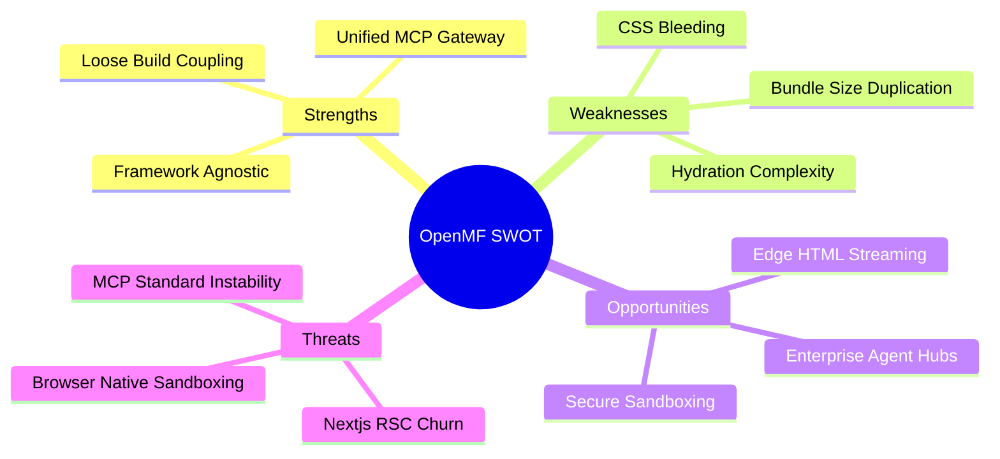
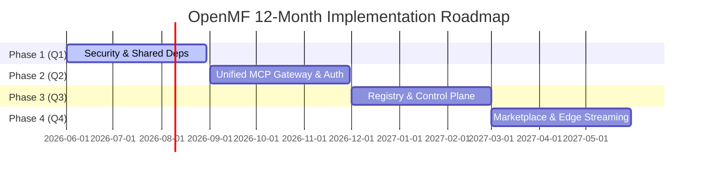

# Critical Architectural Review: Open Micro Frontend Platform (OpenMF)

This document provides an honest, critical evaluation of the OpenMF platform's vision, current architecture, product-market fit, and future roadmap. As requested, this review highlights risks, hidden complexities, and structural trade-offs rather than merely validating the proposed design.

---

## 1. Core Vision: Real Problem or Technology-Driven Hype?

### The Verdict: A Dual-Nature Architecture
The vision sits at the intersection of two distinct architectural trends:
1. **Traditional Micro Frontends (MFE)**: Solving real-world team organizational bottlenecks (independent deployments, heterogeneous tech stacks, separate release lifecycles).
2. **AI-Native Interface Orchestration (MCP/MCP Apps)**: Solving the emerging need for AI agents to discover, interact with, and render visual UI surfaces natively in chat streams.

### Is the AI-native MFE overlap a real problem?
* **Yes, for the immediate future (2027–2030)**: As LLMs shift from text-only generators to agentic workflow coordinators, they need a standardized way to pull in interactive mini-apps (widgets) without needing custom integrations for every tool. By treating a micro-app as a "portable capability surface" (declaring tools, resources, and UI), you solve the problem of *UI delivery to AI hosts*.
* **The Technology-Driven Risk**: Enterprises will not adopt a platform just because it supports MCP. The primary driver for micro-frontends remains **organizational scale**. If the AI-native capability increases cognitive load or degrades runtime performance for standard web users, it will be rejected.

---

## 2. Competitive Landscape

| Capability | Webpack Module Federation | Single-SPA | Piral | MCP Apps SDK (Raw) | **OpenMF (This Project)** |
| :--- | :--- | :--- | :--- | :--- | :--- |
| **Bundler Dependency** | High (Webpack/Rspack) | Low | Low | None | **None (Standards-first)** |
| **Isomorphic Rendering** | Difficult (SSR/RSC) | CSR-centric | CSR-centric | N/A (Iframe only) | **Native (SSR/RSC/ISR/CSR)** |
| **Framework Diversity** | Medium (React focus) | High | High | Low (Iframe wrapper) | **High (React/Vue/Angular)** |
| **AI Host Integration** | None | None | None | High | **Unified Shell & App MCP** |
| **Isolation Boundary** | Low (JS Context) | Low (JS Context) | Low | High (Sandbox) | **Configurable (Custom Element/Iframe)** |

### Genuinely Innovative Elements in OpenMF
1. **Isomorphic App Declarations**: The ability to write a single app definition that executes as a Custom Element in a browser shell, runs standalone as a self-hosting Node server, or connects natively as an MCP App inside Claude or ChatGPT.
2. **The Shell as a Unified MCP Gateway**: Turning the Next.js shell itself into an MCP server. Instead of connecting 20 separate subdomains to Claude, an enterprise connects the shell `/api/mcp` endpoint, exposing the entire application ecosystem with unified routing.
3. **Multi-Rendering Support**: Bridging Server-Side HTML fragment streaming (RSC/SSR) and Client-Side dynamic islands (Web Components/Iframes) under a single SDK interface.

---

## 3. SWOT Analysis

### Strengths
* **Decoupled Build Pipelines**: Eliminates build-time dependency locks (unlike Webpack Module Federation).
* **Consolidated Discovery**: Manifest-first architecture makes it easy for both web shells and LLMs to catalog capabilities.
* **Isomorphic Deployments**: A micro-app can easily self-host (`pnpm start:standalone`) or mount inside a parent Next.js shell.

### Weaknesses
* **CSS Bleeding & Styling Collisions**: Web Components isolate DOM but do not fully isolate global CSS/Tailwind variables unless using Shadow DOM.
* **Heavy Dependency Duplication**: Bundling React, Vue, or Angular into each remote results in massive bundles (e.g. the customer app is ~660KB).
* **Hydration Complexity**: Combining SSR/RSC with Web Component hydration leads to flicker, double-mounting, and hydration mismatches.

### Opportunities
* **Enterprise AI Tool Hubs**: Becoming the default gateway for secure, internal enterprise micro-apps exposed to ChatGPT/Claude.
* **Edge-Side Assembly**: Streaming remote HTML fragments from Cloudflare Workers/Vercel Edge directly into Next.js RSC streams.

### Threats
* **MCP Specification Instability**: Rapid changes in the Model Context Protocol could break the postMessage or SSE transport adaptors.
* **Next.js Core Churn**: Next.js major upgrades (e.g., v15 to v16) frequently introduce breaking changes to RSC fetching and SSR APIs.

---

## 4. Critical Architecture Review & Risks

### Risk 1: Performance Degradation via Dependency Bloat
* **Critical Issue**: In the current POC, each MFE is built as an independent library. If the Customer app bundles React 19, the Billing app bundles React 19, and the Vue Commerce app bundles Vue, the user's browser loads multiple copies of these libraries.
* **Impact**: LCP (Largest Contentful Paint) and INP (Interaction to Next Paint) will degrade dramatically.
* **Mitigation**: The platform needs a **Shared Dependency Manager** (using import maps or CDN-hosted peer dependencies) that allows remotes to declare dependencies as `external` while resolving them to shared runtime instances *without* coupling their build scripts.

### Risk 2: CSS and Token Collisions in Tailwind Projects
* **Critical Issue**: While Custom Elements protect the DOM hierarchy, CSS styles (especially Tailwind utility classes or custom properties like `--color-primary`) will collide if multiple apps define the same CSS variables with different values.
* **Impact**: UI visual bugs, style bleeding, and theme misalignment.
* **Mitigation**: Enforce **Shadow DOM encapsulation** for client-side custom elements, or inject prefixing build rules (`tailwind.config.js` prefixing) dynamically.

### Risk 3: RSC / Hydration Mismatches
* **Critical Issue**: If the shell renders a remote app using the Server Component HTML-fragment path, but that fragment contains client-side interactive elements (e.g., React code needing hydration), there is no unified client bundle to hydrate it unless the MFE's client script is loaded and executed.
* **Impact**: Severe console warnings, lack of interactivity, or double-rendering.
* **Mitigation**: Standardize on **HTML fragments for static/read-only rendering** (SSG/ISR/RSC), and **Web Components/Iframes for highly interactive CSR applications**.

### Risk 4: Event Bus Security & Leakage
* **Critical Issue**: A browser-native `CustomEvent` event bus lacks access control. Any micro-app can listen to `PlatformEvents.USER_LOGGED_IN` or emit malicious events to other apps.
* **Impact**: Privilege escalation, data leakage, and system vulnerability.
* **Mitigation**: Introduce a **Permissions-Gated Event Bus** in the client SDK that validates the sender's origin against the application registry permissions manifest before distributing the event.

---

## 5. Enterprise Adoption Analysis

### Why Enterprises WILL Adopt This
1. **Independent Ship Cycles**: Allows product teams (CRM, Billing, Ops) to deploy on their own cadence without coordination.
2. **Unified AI Enablement**: Provides a low-friction path to expose existing business operations directly into ChatGPT/Claude via the unified MCP route.
3. **Legacy Migration**: Can mount older Vue 2 or Angular apps next to modern Next.js/React applications.

### Why Enterprises WILL REJECT This (Adoption Barriers)
1. **Lack of Security Governance**: Enterprises cannot allow third-party or even different internal team widgets to run in the same DOM context without strict CSP (Content Security Policy) and sandboxing.
2. **Operational Overhead**: Managing 20 standalone servers, subdomains, SSL certs, and monitoring is significantly harder than a single monorepo.
3. **Performance Metrics (Web Vitals)**: CTOs will veto the platform if it degrades SEO or Lighthouse scores due to double-loading frameworks.

### CTO Evaluation: Invest or Pass?
> **Decision: Invest with Scope Limitations.**
>
> **Rationale**: Do not build the "OpenMF Platform" as a general-purpose frontend tool (Module Federation is already too established for standard CSR). Instead, invest in OpenMF specifically as an **Enterprise AI Agent UI Delivery Platform**. The value proposition of converting existing micro-frontends into secure, self-hosting, pluggable MCP UI elements is highly differentiated and solves a new, urgent enterprise problem.

---

## 6. Recommended 12-Month Roadmap

### Quarter 1: Security & Shared Dependencies
* **Core Goal**: Fix performance bloat and secure the runtime container.
* **Milestones**:
  * Implement an **Import Map Resolver** in the SDK shell to dynamically share core packages (React, React-DOM, Vue) at runtime.
  * Enable **Shadow DOM sandboxing** option in `definePlatformApp`.
  * Add a permissions-gated event bus proxy.

### Quarter 2: Unified MCP Gateway & Auth
* **Core Goal**: Secure enterprise connectivity and support AI agent orchestration.
* **Milestones**:
  * Build the **Isomorphic Authentication Bridge** (propagating OAuth tokens from the Next.js shell context down to standalone MFE servers).
  * Enhance the unified shell MCP server (`/api/mcp`) to support streaming responses (Server-Sent Events) and tool proxying back to standalone micro-app servers.

### Quarter 3: Registry Control Plane & Observability
* **Core Goal**: Centralize governance.
* **Milestones**:
  * Develop the **Platform Registry Service**: A centralized service (backed by Redis/Edge Config) that validates manifests, tracks app health, and allows instant rollbacks.
  * Build unified **Distributed Telemetry**: Propagating transaction IDs from the shell, down through the event bus, to individual app logs.

### Quarter 4: Developer Ecosystem & Edge Optimization
* **Core Goal**: Scale adoption.
* **Milestones**:
  * Create CLI tool `create-openmf-app` with presets for React, Vue, Angular, and Next.js.
  * Implement Edge-side HTML streaming: Streaming micro-app HTML fragments via Cloudflare Workers directly into RSC streams.

---

## 7. Open Source & Positioning Strategy

### Market Positioning Statement
> **"OpenMF is the framework-neutral, AI-native micro frontend platform. It enables teams to build portable web applications that run seamlessly in a traditional web shell or inside AI agent streams (ChatGPT, Claude) using standard browser contracts."**

### Contributor Attraction Strategy
1. **Target the "Module Federation Exhaustion" group**: Developers who are tired of complex webpack config alignments and want a standards-first (ESM + Custom Elements) MFE platform.
2. **Target the AI Developer community**: Provide the easiest template to convert a React dashboard into a Claude-ready interactive widget.
3. **Keep the SDK zero-dependency**: Minimize package footprint to ensure it remains easy to audit and adopt.
